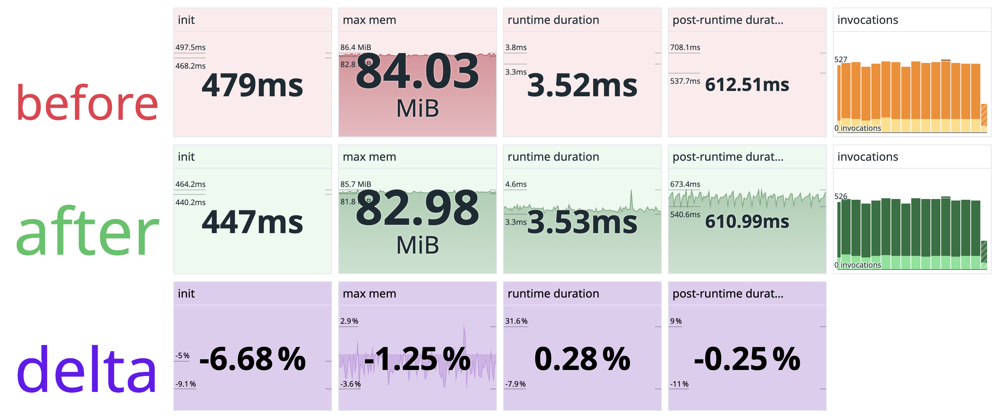

# dd-python-cold-start-testing

A simple test app with dashboard for performing before/after comparisons of
`dd-trace-py` changes

This guide will walk you through creating lambda layers with unpublished
versions of `dd-trace-py` and `datadog-lambda-python`. You will then deploy two
lambda functions you wish to compare and execute them. Lastly, you'll be able
to view results in a custom dashboard.

## Deploy

### Publish testing lambda layers

This will certainly be the trickiest step in the process of using this repo.
But fear not, I'll walk you through it. Once you've done it once, it will be
easier every other time.

1. Check out both [`dd-trace-py`](https://github.com/DataDog/dd-trace-py) _and_
   [`datadog-lambda-python`](https://github.com/DataDog/datadog-lambda-python)
   repos to your laptop.

1. Make your change to either `dd-trace-py` or `datadog-lambda-python`. Commit
   and push those changes.

1. Build and publish your layers using the provided publish script. You'll
   first want to set any environment variables to change configuration from its
   default. See the help text at the top of the [`publish.sh`](publish.sh) script for all
   available configuration options.

    ```bash
    $ export REGION=us-east-1
    $ export SUFFIX=purple
    ```

1. Then, run the publish script. Replace the `dd-trace-py` branch you used
   above, if you didn't make changes to `ddtrace`, then you can leave the
   argument blank.

    ```bash
    $ aws-vault exec <your-aws-account-here> -- ./publish.sh <dd-trace-py-branch>
    ```

1. Take note of the AWS Lambda Layer ARN printed to stdout by the publish
   script. You will use this arn in the steps below.

### Deploying to AWS Lambda

1. You will use [Serverless Framework](https://www.serverless.com/) to deploy
   your lambda stack.  To install, run

    ```bash
    $ npm i serverless -g
    ```

1. Identify which AWS region, python version, and architecture you wish to use.
   Update these values in the [serverless.yml](serverless.yml) file.

1. Update layer versions on the before and after functions in the
   [serverless.yml](serverless.yml) file. These can either be publicly
   available layers or ones you deployed yourself above.

1. Identify which AWS and DataDog accounts you wish to use and deploy the
   stack.

    ```bash
    $ export DD_API_KEY=<your-dd-api-key-here>
    $ aws-vault exec <your-aws-account-here> -- sls deploy
    ```

## Execute

You're probably mostly interested in seeing differences in cold start times
between layer versions. This means you'll probably want to have a lot of cold
starts to compare. You can do this by calling the execute script

```bash
$ aws-vault exec <your-aws-account-here> -- ./execute.sh
```

If you need to update the AWS account or region, they can be changed via
environment variables, such as

```bash
$ export REGION=us-east-1
$ export ACCOUNT=1234567890
$ aws-vault exec <your-aws-account-here> -- ./execute.sh
```

Let the script run for 5-10 minutes or more to produce enough data.

## Analyze

If you're using the `ddserverless` DataDog org, then you can use the ["Rey's
Awesome Purple Dashboard"](https://ddserverless.datadoghq.com/dashboard/5yn-x2m-2ne/reys-awesome-purple-dashboard?fromUser=false&refresh_mode=paused&from_ts=1746664500908&to_ts=1746664800908&live=false&tile_focus=4418579574713790)
to view the results. Otherwise, you can create a new DataDog dashboard using
the provided `dashboard.json` file.

Note that you may need to update the `before-funcname` and `after-funcname`
dashboard variable at the top of the page. By default, the `serverless.yml`
file will deploy your functions as `python-ab-test-dev-before` and
`python-ab-test-dev-after` respectively.


